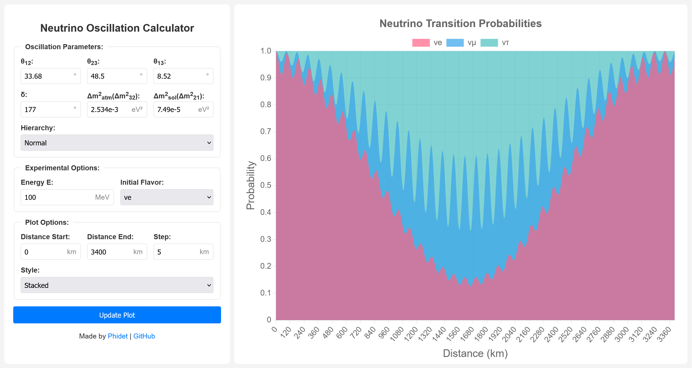

# Neutrino Oscillation Calculator - [Try it here](http://pdg.det.je/)

## Overview
A web tool to calculate and visualise neutrino flavour oscillations.

## Contribution
Improvement suggestions are welcome!

## License
Licensed under the MIT License. See the LICENSE file in the repository for details.
